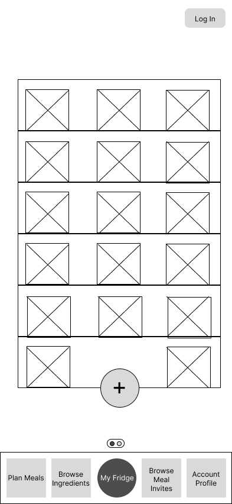

# WasteWise

## Overview
Tired of throwing away forgotten food that have gone bad? Bought Too much food that you can not finish? Are you passionate about cooking but are unsure about what to make with your given ingredients? WasteWise is a perfect solution addressing all these issues! 

WasteWise is a web app that allows userst to record and keep track of current items in their fridge and their expiration dates. Given the ingredients, the app makes recipe recommendations. The user can register and login. The user can also browse community posts about meals or ingredients they can purchase from their friends. Once logged in, they can also submit inquires and respond to these posts. 

## Team members

Gefei Gong
Siyu Bi
Kevin Huang
Lucy Sun

## Instructions for building and testing 
(will update with that information once the project reaches that stage)

## App designs
### App Map 

### Wireframes

/ - Home page for WasteWise app, provides overview for available food and recommended Recipe

.png)

/ - Plan Meals page for breakfast, lunch, and dinner recommendations

/ - Recommend Recipes with the current ingredients. 

/ - View community posts about ingredients. 

.png)

/ - View ingredient Details. 

/ - Post ingredients. 

/ - View fridge. 

/ - View fridge ingredients in list form

/ - View ingredient Details. 

/ - View fridge ingredients in list form

/ - View Account Profile

/ - Login page. 

/ - Register new user. 

/ - Browse Meal invites. 

.png)

/ - View meal invite and RSPV or comment. 

/ - Create new invite. 

This repository will be used for team projects.

Several sets of instructions are included in this repository. They should each be treated as separate assignments with their own due dates and sets of requirements.

1. See the [App Map & Wireframes](instructions-0a-app-map-wireframes.md) and [Prototyping](./instructions-0b-prototyping.md) instructions for the requirements of the initial user experience design of the app.

1. Delete the contents of this file and replace with the contents of a proper README.md, as described in the [project setup instructions](./instructions-0c-project-setup.md)

1. See the [Sprint Planning instructions](instructions-0d-sprint-planning.md) for the requirements of Sprint Planning for each Sprint.

1. See the [Front-End Development instructions](./instructions-1-front-end.md) for the requirements of the initial Front-End Development.

1. See the [Back-End Development instructions](./instructions-2-back-end.md) for the requirements of the initial Back-End Development.

1. See the [Database Integration instructions](./instructions-3-database.md) for the requirements of integrating a database into the back-end.

1. See the [Deployment instructions](./instructions-4-deployment.md) for the requirements of deploying an app.
