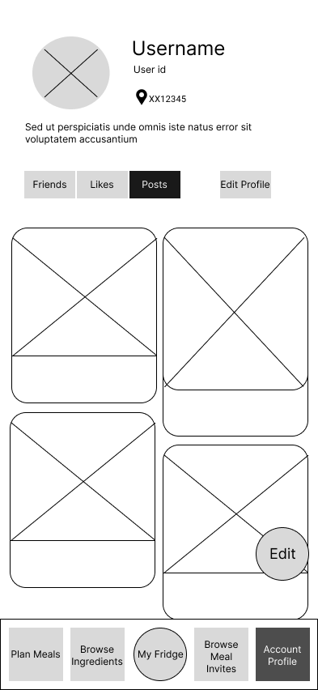
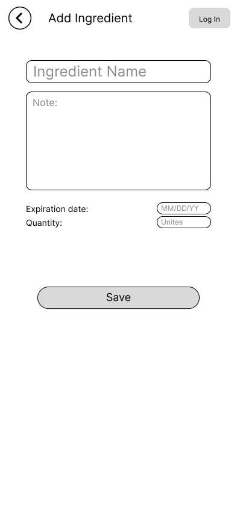
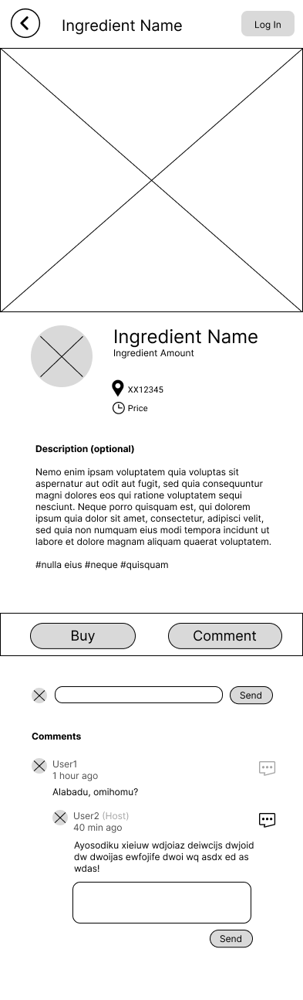
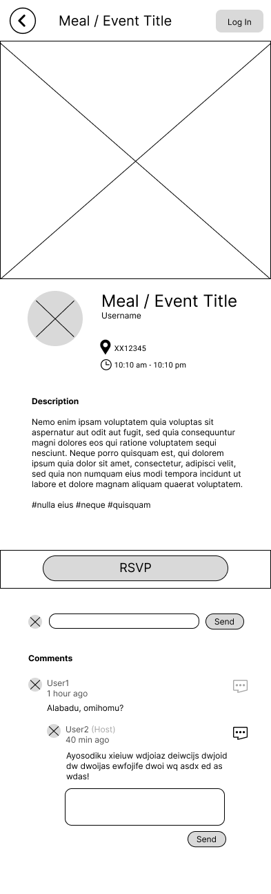
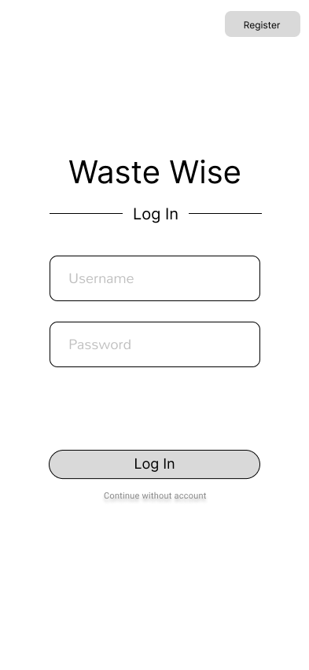
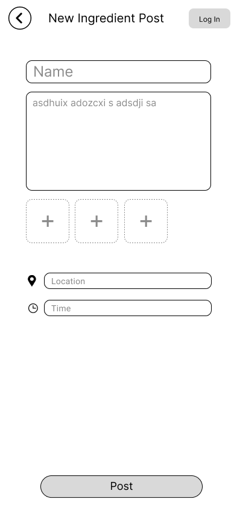
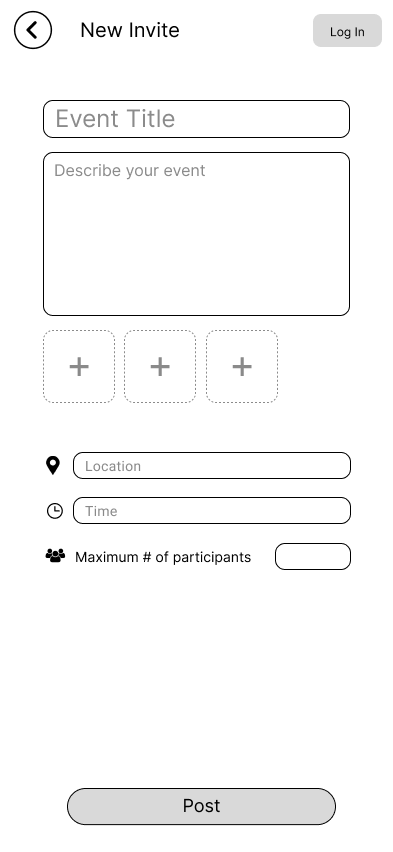
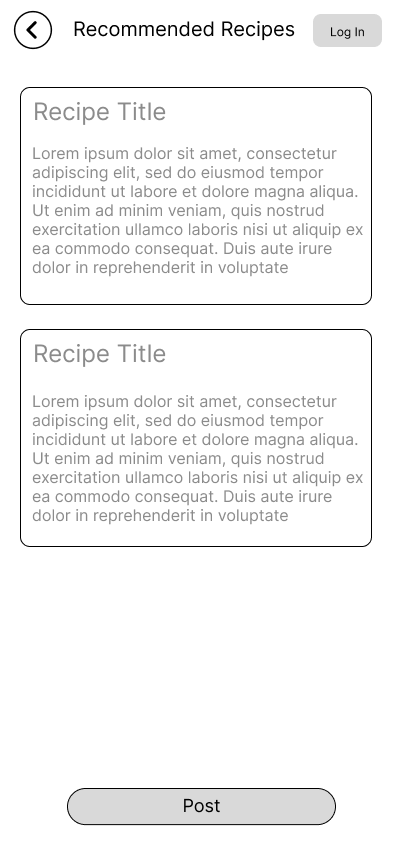
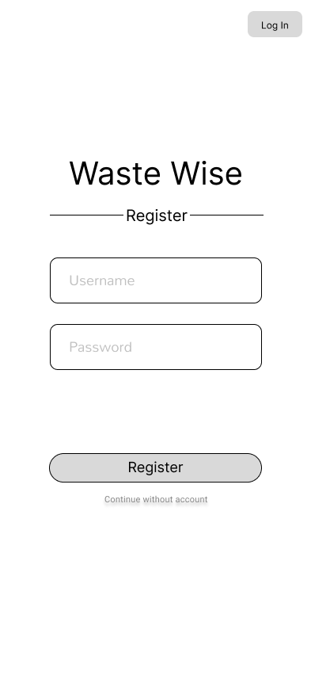

# User Experience Design

## Prototype

* Figma link: https://www.figma.com/proto/LOtlcvLJMnR5EhQvi1QTxq/Agile-Architects-EcoTracker?type=design&node-id=100-429&t=MaryqZRbK8ydlcbA-1&scaling=scale-down&page-id=0%3A1&starting-point-node-id=100%3A429&mode=design

## Wireframes

### Account Profile 

### Add ingredient

### Browse Ingredients (full page ver.)
.png)

### Fridge Details (short ver.)
.png)

### Fridge

### Ingrediant Details

### Ingredient Details

### Invite Details

### Log In

### New Ingredient Post

### New Invite

### Plan Meals (Home Page)
.png)

### Recommend Recipes

### Register Account

